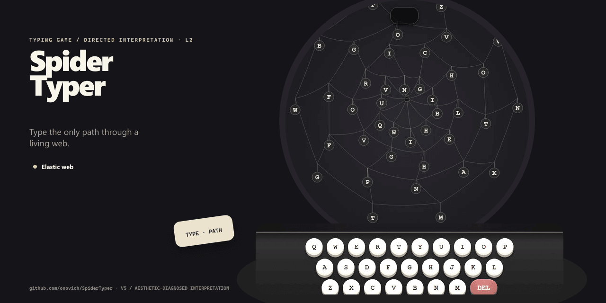

# SpiderTyper

[English](README.md)

在具有物理弹性的蜘蛛网上消除字母歧义、引导蜘蛛捕食的打字动作游戏。



## 项目包含什么

- 弹性蛛网。
- 字母歧义。
- 蜘蛛移动。

## 快速开始

安装依赖并启动本地版本：

```bash
npm install
npm run dev
```

仓库还提供 `npm run build`。

## 仓库结构

- `src/` — 应用与库的源代码。
- `origin/` — 原始原型与设计资料。
- `.github` — 自动化与 GitHub Pages 工作流。
- `index.html` — Web 入口。
- `package.json` — 包脚本与依赖。

## 文档

- [`origin/design.md`](origin/design.md)

## 当前状态

仓库已经包含与上述用途对应的实现和项目材料。当前仓库没有自动化测试，评估时请在目标环境中直接运行。

## 许可证

当前仓库未包含开源许可证。
